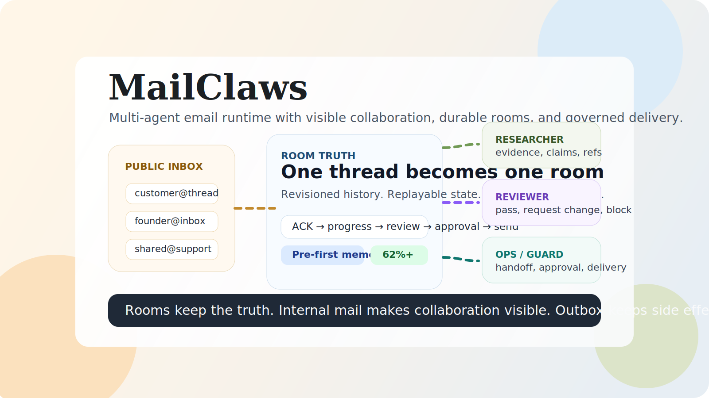

# MailClaws

<p align="center">
  The multi-agent mail runtime that keeps context small, handoffs visible, and long-running work under control.
</p>

<p align="center">
  <a href="./README.md"><strong>English</strong></a> ·
  <a href="./README.zh-CN.md">简体中文</a> ·
  <a href="./README.fr.md">Français</a>
</p>

<p align="center">
  <a href="https://dangozhang.github.io/mailclaw/">Website</a> ·
  <a href="https://github.com/dangoZhang/mailclaw/actions/workflows/ci.yml">CI</a> ·
  <a href="https://github.com/dangoZhang/mailclaw/actions/workflows/release.yml">Release</a>
</p>

<p align="center">
  
</p>

MailClaws is what happens when you stop treating email like a thin transport and start treating it like the actual runtime surface for agent work. One real thread becomes one durable room. One public agent can bring in researchers, reviewers, operators, and specialist roles by internal mail. Every handoff stays visible. Every draft can be reviewed. Every external send can be governed.

It is especially strong when work arrives as interruptions, follow-ups, shared inbox traffic, and long-running threads that need status updates before they need a final answer.

## The MailClaws Edge

MailClaws is built around a simple but powerful idea: **multi-agent work should look like teamwork, not like one giant hidden transcript**. Instead of burying subagent work inside a black-box run, MailClaws lets one front agent receive the room, delegate by internal mail, collect evidence and draft packets back through single-parent reply chains, and keep the whole chain visible in the Mail tab. The result feels closer to a real office than to a swarm pretending to be one brain.

And because the system carries forward compact Pre state instead of dragging the full transcript into every turn, it stays fast when the inbox gets busy. In the repository benchmark, long-thread follow-ups drop from **2006** estimated tokens to **755** on average, turn-6 follow-ups drop from **2868** to **752**, and a 5-worker reducer handoff drops from **3444** to **750**. That is not just cheaper. It is what makes room switching, progress reporting, and visible multi-agent collaboration practical instead of exhausting.

## Why Email Turns Out To Be The Right Surface

Email already gives you the things multi-agent work actually needs: a natural context boundary, a shareable history, a human-readable pace, and a workflow people already understand. A thread is the right size for one unit of work. Replies preserve accountability. Forwarding and CC already match real collaboration habits. The message format is short enough to stay disciplined, long enough to carry useful thought, and familiar enough that users do not need a second operating system just to work with their agents. You connect a mailbox people already use, and the system starts there instead of asking everyone to adopt a brand-new ritual.

## Multi-Agent, But Actually Visible

- One public agent can own the front inbox while specialist agents work behind it.
- Internal collaboration appears as virtual mailboxes, work threads, and reducer-driven convergence.
- ACK, progress, review, approval, and final send all stay attached to the same room.
- The Workbench shows who saw what, who replied, which draft won, and what got blocked.
- Burst subagents stay compute-only; durable agents keep their own `SOUL.md`, mailbox, and memory boundary.

This is the signature feature. MailClaws does not just support multiple agents. It makes multiple agents legible.

## Three Minutes To Your First Agent Email

```bash
./install.sh
MAILCLAW_FEATURE_MAIL_INGEST=true mailclaw
```

In a second terminal:

```bash
mailclaw onboard you@example.com
mailclaw login
mailclaw dashboard
```

Then do this:

1. Connect any mailbox you already use.
2. Send one email to it from another mailbox.
3. Open the Workbench and click `Mail`.
4. Watch the room appear, the internal collaboration happen, and the reply chain form.
5. Let your agents send you their first real email through the governed outbox flow.

If you want a safe local walkthrough first, run `pnpm demo:mail` and open `http://127.0.0.1:3020/workbench/mail`.

## Start Fast With Templates

Templates exist so a new user can go from zero to a believable multi-agent setup in one click.

- `One-Person Company` gives you a front desk plus durable specialist peers, adapted from the operating style popularized by <https://github.com/cyfyifanchen/one-person-company>.
- `Three Provinces, Six Departments` gives you a larger review-and-governance roster aligned to the `Edict` structure at <https://github.com/cft0808/edict>.

Template implementation lives here:

- <https://github.com/dangoZhang/mailclaw/blob/main/src/agents/templates.ts>

When you apply the larger roster, generated `SOUL.md` files include upstream alignment notes and role contracts so the team shape stays intentional instead of drifting into a name-only homage.

## Website And Workbench

- Website: <https://dangozhang.github.io/mailclaw/>
- Workbench: run `mailclaw dashboard`, sign in, and click `Mail`

The website explains the concepts. The Workbench lets you see the whole system live.

## License

MIT. See [LICENSE](./LICENSE).
