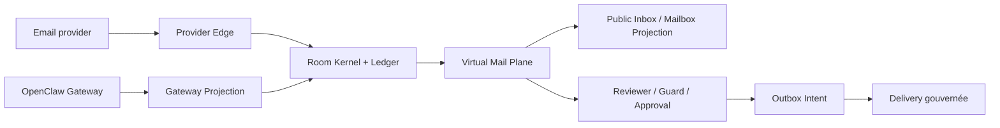
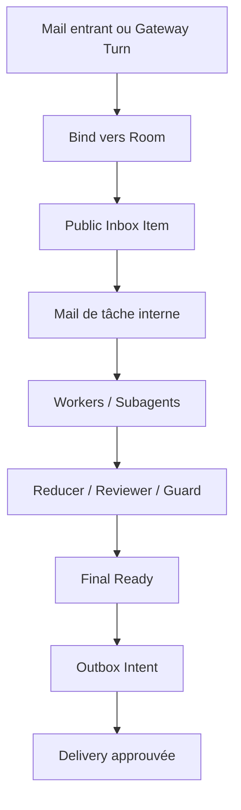
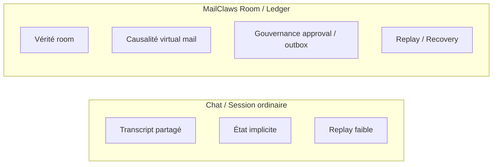
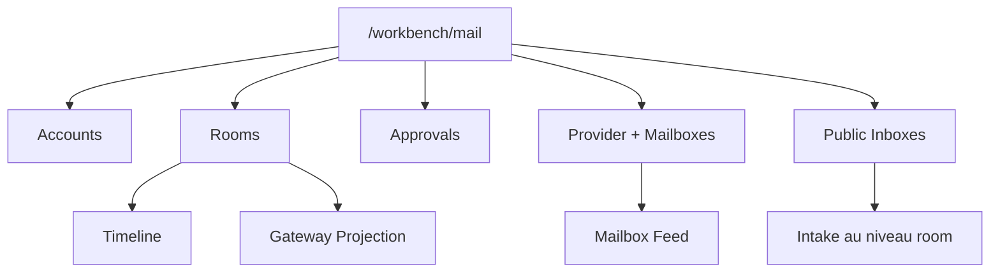

# Assets De Release

  <a href="./release-assets.md">English</a> ·
  <a href="./release-assets.zh-CN.md">简体中文</a> ·
  <a href="./release-assets.fr.md"><strong>Français</strong></a>

Cette page fixe le texte et les schémas natifs au dépôt pour la forme actuelle de la release MailClaws. Ces assets servent au hero README, au positionnement de `/workbench/mail` et aux démonstrations.

## Narratif De Release

- Titre de release : MailClaws transforme les threads email en rooms durables et gouvernées pour le travail multi-agent.
- Sous-titre : l’email externe reste un transport, la coordination interne devient du virtual mail, et l’envoi final reste approval-gated et replayable.
- Angle de lancement : présenter MailClaws comme un runtime et une surface d’observabilité pour opérateurs, pas comme un simple wrapper de chat ni comme un client mailbox complet.

## Texte Hero

- One-liner : MailClaws est un runtime email-native pour un travail durable, auditable et multi-agent.
- Positionnement : OpenClaw reste le substrate amont de l’écosystème ; MailClaws possède la vérité des rooms, la sémantique de collaboration virtual mail, la gouvernance approval/outbox, ainsi que replay/recovery.
- Limite : le mail workbench actuel est une surface en lecture seule, pas un client mailbox complet.
- Pitch court : MailClaws garde la compatibilité transport côté email externe tout en replaçant l’état, les approbations et la récupération dans un ledger room kernel-first.
- Pitch opérateur : les équipes peuvent inspecter l’historique room, les approbations, le provider state, le mailbox feed, les public inboxes et les traces Gateway depuis une seule surface.

## Ce Qui Est Livré

- Vérité room avec ledger rejouable, état room révisionné et surfaces de recovery durables.
- Virtual mail plane pour la collaboration interne workers/subagents avec mailbox projections et causalité single-parent reply.
- Gouvernance approval/outbox pour que l’email sortant réel passe par des intents auditables au lieu d’effets de bord directs.
- Observabilité provider et mailbox avec account state, mailbox feed, public inbox projection et traces d’événements provider.
- Support Gateway projection avec room-bound outcome tracing et statut de dispatch inspectable.
- Mail workbench en lecture seule sur `/workbench/mail` plus surfaces CLI/API pour les opérations day-2.

## À Ne Pas Revendiquer

- Ne pas présenter cette release comme un client mailbox complet de type Outlook.
- Ne pas laisser entendre que l’automatisation amont Gateway ou Workbench est entièrement câblée de bout en bout.
- Ne pas laisser entendre que workers ou subagents peuvent contourner les outbox intents pour l’envoi externe réel.
- Ne pas laisser entendre que MailClaws remplace l’auth provider, les politiques de transport ou les contrôles de conformité natifs des boîtes mail.

## Preuves À Mettre En Avant

- Les rooms survivent aux sessions transitoires et peuvent être rejouées depuis un état durable.
- La collaboration interne est visible comme du virtual mail, pas cachée dans des mutations de prompt.
- Approval, resend, quarantine et provider inspection sont des actions opérateur de premier rang.
- Public inboxes et mailbox projections rendent l’intake et le backlog visibles sans déplacer la vérité room.

## Pack D’Assets Prêt À Publier

- Modèle d’annonce:
  `headline + one-liner + ce qui est livré + limites + liens docs`
- Modèle d’email produit:
  `valeur opérateur + positionnement architecture + limites explicites`
- Kit de démonstration:
  `vue des capacités + flux de collaboration + chat-vs-room + IA console`
- Walkthrough console:
  `room timeline -> mailbox feed -> approvals/outbox -> gateway trace`
- Extrait de changelog:
  `nouvelles capacités + non-objectifs de cette release`

## Snippets De Copy Prêts À L’Emploi

- Ouverture d’annonce:
  "MailClaws est maintenant livré comme runtime email orienté opérateur: vérité room, collaboration virtual mail, et envoi externe gouverné."
- Fermeture compatible limites:
  "Cette release livre un mail workbench en lecture seule et des primitives de contrôle durables; elle ne livre pas encore un client mailbox complet."
- CTA opérateur:
  "Utilisez `/workbench/mail`, `mailctl` et les traces replay pour inspecter intake, approvals, posture de delivery, et lignée de projection Gateway."

## Vue D’Ensemble Des Capacités

## Flux De Collaboration

## Comparaison Chat-vs-Room

## Storyboard De Démo

1. Montrer un email entrant réel ou un Gateway turn qui arrive dans MailClaws.
2. Ouvrir le détail room et souligner la timeline révisionnée, la vérité room et la capacité de replay.
3. Montrer la collaboration interne dans les vues mailbox/feed plutôt que comme transcript partagé opaque.
4. Montrer reviewer, guard, approval ou outbox avant tout envoi externe réel.
5. Terminer dans `/workbench/mail` avec provider state, mailbox feed, public inbox projection et Gateway trace visibles ensemble.

## Checklist D’Assets

- Capture hero : `/workbench/mail` avec détail room, timeline, résumé approval et participation mailbox visibles.
- Capture mailbox : panneau provider + mailboxes avec cartes mailbox et état du feed.
- Capture inbox : public inbox projection avec intake et backlog au niveau room.
- Capture trace : Gateway projection trace ou sortie replay montrant une lignée opérateur inspectable.
- Jeu de schémas : vue d’ensemble des capacités, flux de collaboration, comparaison chat-vs-room, architecture d’information console.

## Légendes Réutilisables

- "Email in, governed work out."
- "La vérité vit dans les rooms ; les mailboxes projettent le travail."
- "La collaboration interne reste inspectable, rejouable et approval-gated."
- "Surface opérateur aujourd’hui, client mailbox plus tard."

## Checklist De Gate Avant Publication

- Tous les canaux utilisent le même one-liner et la même boundary statement.
- Aucun canal ne revendique une parité mailbox de type Outlook.
- Aucun canal ne revendique une automatisation amont Gateway/Workbench complète.
- Les démos montrent la gouvernance approval/outbox avant tout envoi externe réel.
- Les liens docs pointent vers les pages actuelles:
  `getting-started`, `operator-console`, `operators-guide`, `integrations`.

## Architecture D’Information De La Console

