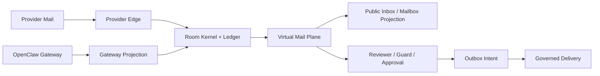
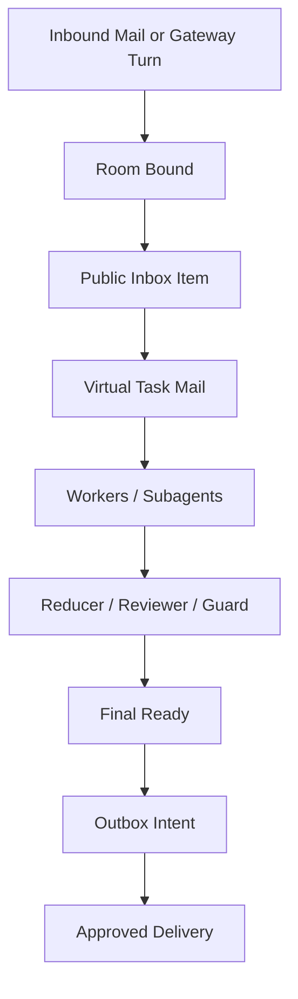
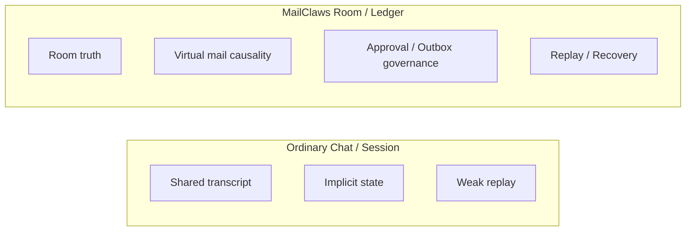
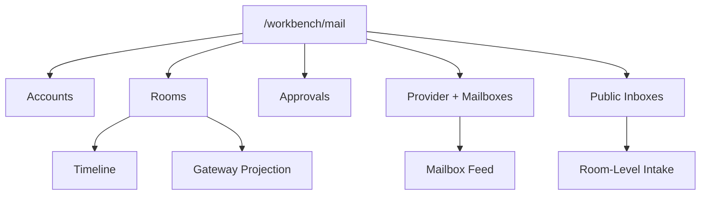

# Release Assets

  <a href="./release-assets.md"><strong>English</strong></a> ·
  <a href="./release-assets.zh-CN.md">简体中文</a> ·
  <a href="./release-assets.fr.md">Français</a>

This page defines the repo-native release copy and diagrams for the current MailClaws release shape. Use these assets for README hero copy, `/workbench/mail` positioning, and demo walkthroughs.

For the release-ready changelog and GitHub release body, see [Release Notes: v0.1.0](./release-notes-v0.1.0.md).

## Release Narrative

- Release headline: MailClaws turns email threads into durable, governed rooms for multi-agent work.
- Release subhead: External email stays transport. Internal coordination becomes virtual mail. Final delivery stays approval-gated, replayable, and inspectable.
- Launch angle: ship MailClaws as an email-native runtime and workbench surface, not as a generic chat wrapper and not as a full mailbox replacement.

## Hero Copy

- One-liner: MailClaws is an email-native runtime for durable, auditable, multi-agent work.
- Positioning: OpenClaw remains the upstream ecosystem substrate; MailClaws owns room truth, virtual mail collaboration semantics, approval/outbox governance, and replay/recovery.
- Boundary: the current Mail workbench is read-only and not a full mailbox client.
- Short pitch: MailClaws keeps external mail transport-compatible while moving state, approvals, and recovery into a kernel-first room ledger.
- Workbench pitch: Teams can inspect room history, approvals, provider state, mailbox feeds, inbox pressure, and Gateway projection traces from one surface.

## What Ships In This Release

- Room-first truth with replayable ledger, revisioned room state, and durable room recovery surfaces.
- Virtual mail plane for internal worker and subagent collaboration with mailbox projections and single-parent reply causality.
- Approval/outbox governance so real outbound mail flows through auditable intents instead of direct worker side effects.
- Provider and mailbox observability covering account state, mailbox feed, public inbox projection, and provider event traces.
- Gateway projection support with room-bound outcome tracing and inspectable projection dispatch status.
- Read-only Mail workbench at `/workbench/mail` plus CLI and API inspection surfaces for day-2 operations.

## Do Not Claim

- Do not position this release as a full Outlook-like mailbox client.
- Do not imply upstream Gateway or Workbench event-stream automation is complete end to end.
- Do not imply workers or subagents can bypass outbox intents for real external delivery.
- Do not imply MailClaws replaces provider auth, transport policy, or mailbox-native compliance controls.

## Proof Points For Launch Copy

- Rooms survive beyond transient sessions and can be replayed from durable state.
- Internal collaboration is visible as virtual mail rather than hidden prompt mutation.
- Approval, resend, quarantine, and provider inspection are first-class workbench actions.
- Public inbox and mailbox projections let teams inspect intake pressure without changing room truth.

## Ship-Ready Asset Pack

- Announcement post:
  `headline + one-liner + what-ships + boundaries + docs links`
- Product update email:
  `workbench value + architecture positioning + migration-safe boundaries`
- Demo deck:
  `capability overview + collaboration flow + chat-vs-room + console IA`
- Console walkthrough:
  `room timeline -> mailbox feed -> approvals/outbox -> gateway trace`
- Changelog snippet:
  `new capabilities + explicit non-goals for this release`

## Ready-To-Publish Copy Snippets

- Announcement opener:
  "MailClaws now ships as an email-native workbench runtime: room truth, virtual mail collaboration, and governed outbound delivery."
- Boundary-safe closer:
  "This release ships a read-only Mail workbench and durable control-plane primitives; it does not yet ship a full mailbox client."
- Workbench CTA:
  "Use `/workbench/mail`, `mailctl`, and replay traces to inspect intake, approvals, delivery posture, and Gateway projection lineage."

## Capability Overview

## Collaboration Flow

## Chat-vs-Room Comparison

## Demo Storyboard

1. Show a real inbound email or Gateway turn landing in MailClaws.
2. Open the room detail and point out revisioned timeline, room truth, and replayability.
3. Show internal collaboration as mailbox/feed activity rather than hidden transcript mutation.
4. Show reviewer, guard, approval, or outbox state before any real outbound delivery.
5. End in `/workbench/mail` with provider state, mailbox feed, public inbox projection, and Gateway trace visible.

## Asset Checklist

- Hero screenshot: `/workbench/mail` with room detail, timeline, approval summary, and mailbox participation visible.
- Mailbox screenshot: provider plus mailbox panel showing mailbox cards and feed state.
- Inbox screenshot: public inbox projection with room-level intake and backlog.
- Trace screenshot: Gateway projection trace or replay output proving inspectable workbench lineage.
- Diagram set: capability overview, collaboration flow, chat-vs-room comparison, console information architecture.

## Reusable Captions

- "Email in, governed work out."
- "Rooms hold truth; mailboxes project work."
- "Internal collaboration stays inspectable, replayable, and approval-gated."
- "Workbench-first today, mailbox-client later."

## Publish Gate Checklist

- All release copy uses the same one-liner and boundary statement.
- No channel claims Outlook-like mailbox parity.
- No channel claims full upstream Gateway/Workbench automation.
- Demo artifacts show approval/outbox governance before external delivery.
- Docs links resolve to current pages:
  `getting-started`, `operator-console`, `operators-guide`, `integrations`.

## Console Information Architecture

