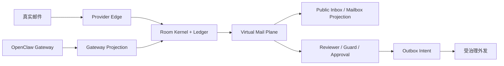
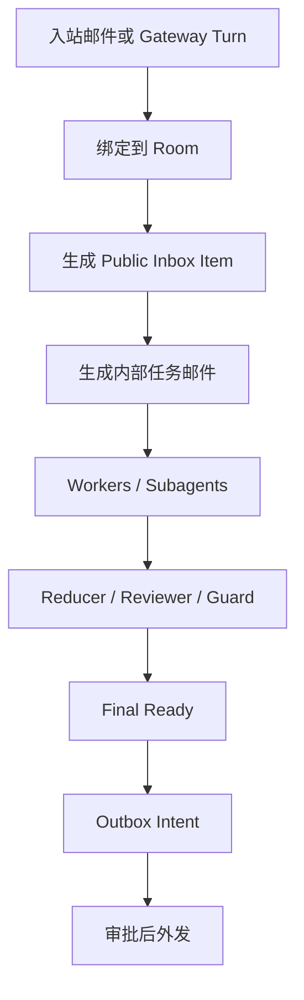
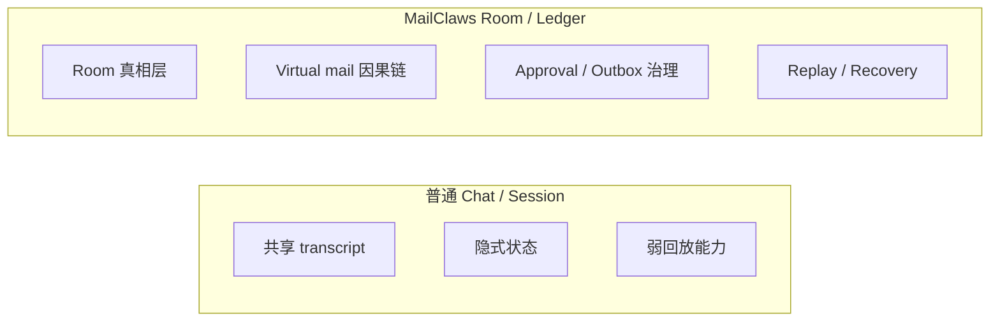
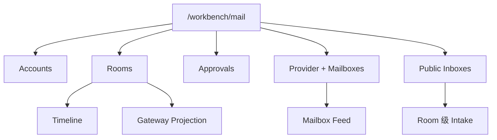

# 发布素材

  <a href="./release-assets.md">English</a> ·
  <a href="./release-assets.zh-CN.md"><strong>简体中文</strong></a> ·
  <a href="./release-assets.fr.md">Français</a>

本页定义当前 MailClaws 发布形态所使用的仓库内文案与图示资产，可复用于 README 首屏、`/workbench/mail` 首页定位和演示材料。

## 发布叙事

- 发布标题：MailClaws 把邮件线程升级成可持续、可治理、可回放的 room。
- 发布副标题：外部邮件继续只是 transport，内部协作进入 virtual mail，真实外发继续经过 approval/outbox。
- 发版角度：这一版要把 MailClaws 讲成邮件原生 runtime 与 workbench 观察面，而不是聊天壳子，也不是完整邮箱客户端。

## Hero 文案

- 一句话：MailClaws 是面向耐久化、可审计、多智能体协作的邮件原生运行时。
- 定位：OpenClaw 继续作为上游生态 substrate；MailClaws 负责 room 真相层、virtual mail 协作语义、approval/outbox 治理，以及 replay/recovery。
- 边界：当前 Mail workbench 为只读观察面，不是完整邮箱客户端。
- 短版说明：MailClaws 保持外部邮件 transport 兼容，同时把状态、审批、恢复放回 kernel-first 的 room ledger。
- Workbench 说明：团队可以在一个面里查看 room 历史、approval、provider state、mailbox feed、public inbox 和 Gateway trace。

## 本版已交付

- 以 room 为真相边界，具备 replayable ledger、revision 化 room 状态和 durable recovery 观察面。
- 以 virtual mail plane 承载内部 worker/subagent 协作，支持 mailbox projection 与 single-parent reply 因果链。
- 以 approval/outbox 做真实外发治理，避免 worker 直接产生不可审计副作用。
- 提供 provider 与 mailbox 可观测性，包括 account state、mailbox feed、public inbox projection 和 provider event trace。
- 提供 Gateway projection 与 room-bound outcome trace，可检查 projection dispatch 状态。
- 内置 `/workbench/mail` 只读 Mail workbench，并提供 CLI/API 观测与运维接口。

## 不要超卖

- 不要把当前版本描述成完整 Outlook 风格邮箱客户端。
- 不要暗示上游 Gateway 或 Workbench 的自动事件流接线已经全部完成。
- 不要暗示 worker 或 subagent 可以绕过 outbox intent 直接真实外发。
- 不要暗示 MailClaws 取代 provider 自身的认证、传输策略或邮箱合规控制。

## 发版可用证明点

- Room 不依赖瞬时 session，能从 durable state 重放。
- 内部协作以 virtual mail 形式显式可见，而不是藏在 prompt 变异里。
- approval、resend、quarantine、provider inspection 都是一等 workbench 动作。
- public inbox 和 mailbox projection 让 intake/backlog 可观测，同时不改变 room 真相层。

## 可直接发版的资产包

- 公告贴模板：
  `标题 + 一句话 + 本版已交付 + 当前边界 + 文档链接`
- 更新邮件模板：
  `workbench 价值 + 架构定位 + 边界声明`
- 演示材料：
  `能力概览 + 协作流程 + chat-vs-room 对比 + console IA`
- Mail workbench walkthrough：
  `room timeline -> mailbox feed -> approvals/outbox -> gateway trace`
- 变更日志模板：
  `新增能力 + 本版不做事项`

## 可直接复用的对外文案

- 公告开场：
  “MailClaws 这一版正式以邮件原生 workbench 运行时发布：room 真相层、virtual mail 协作、受治理外发。”
- 边界收口：
  “当前版本交付只读 Mail workbench 与耐久控制面能力，不是完整邮箱客户端。”
- Workbench 行动引导：
  “通过 `/workbench/mail`、`mailctl` 与 replay trace 可统一查看 intake、审批、外发状态和 Gateway 投影链路。”

## 能力概览图

## 协作流程图

## Chat 与 Room 的对比图

## 演示脚本

1. 展示一封真实入站邮件或一个 Gateway turn 进入 MailClaws。
2. 打开 room 详情，强调 revision timeline、room 真相和 replayability。
3. 展示内部协作如何体现在 mailbox/feed，而不是隐藏在共享 transcript 中。
4. 展示 reviewer、guard、approval 或 outbox 状态，然后再说明真实外发。
5. 最后落到 `/workbench/mail`，把 provider state、mailbox feed、public inbox projection、Gateway trace 放在同一叙事里。

## 素材清单

- Hero 截图：`/workbench/mail` 的 room detail，包含 timeline、approval 摘要和 mailbox participation。
- Mailbox 截图：provider + mailboxes 面板，展示 mailbox cards 与 mailbox feed。
- Inbox 截图：public inbox projection，展示 room 级 intake 和 backlog。
- Trace 截图：Gateway projection trace 或 replay 输出，证明链路可检查。
- 图示套件：能力概览、协作流程、chat-vs-room 对比、console 信息架构。

## 可复用标题/短句

- “邮件进，治理后的工作流出。”
- “Room 负责真相，Mailbox 负责投影。”
- “内部协作可观察、可回放、可审批。”
- “今天先做 Mail workbench，邮箱客户端以后再做。”

## 发布前门槛检查

- 三个渠道文案使用同一条一句话定位与边界声明。
- 任何渠道都不宣称已达到 Outlook 风格邮箱客户端能力。
- 任何渠道都不宣称已完成上游 Gateway/Workbench 全自动闭环。
- 演示素材必须体现 approval/outbox 先于真实外发。
- 文档链接必须指向当前有效页面：
  `getting-started`、`operator-console`、`operators-guide`、`integrations`。

## Console 信息架构

