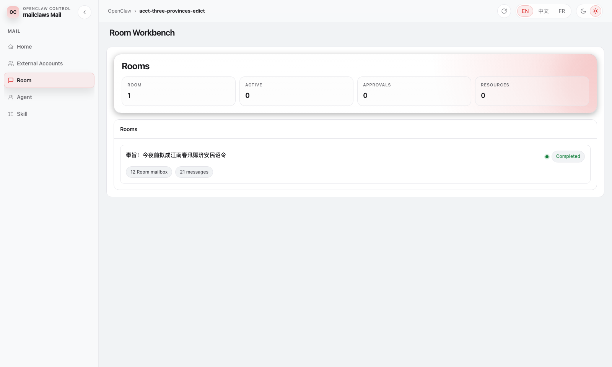
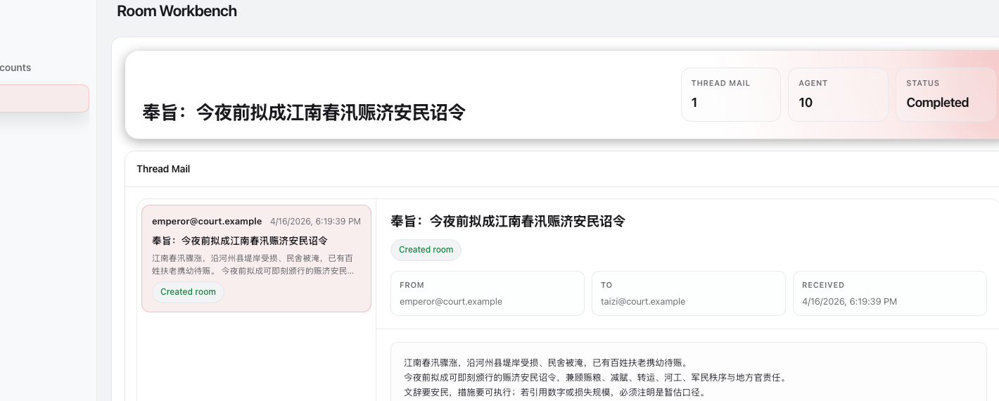
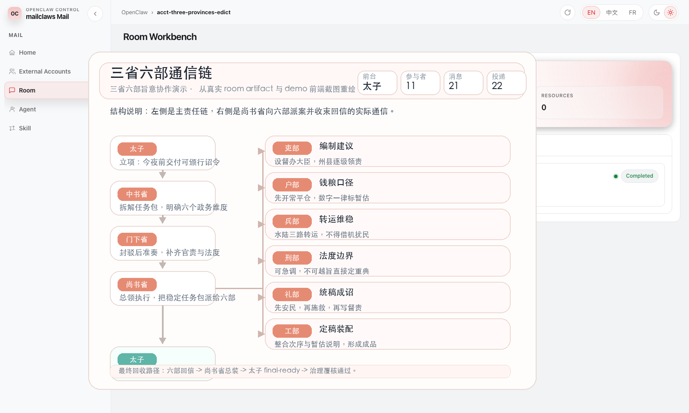
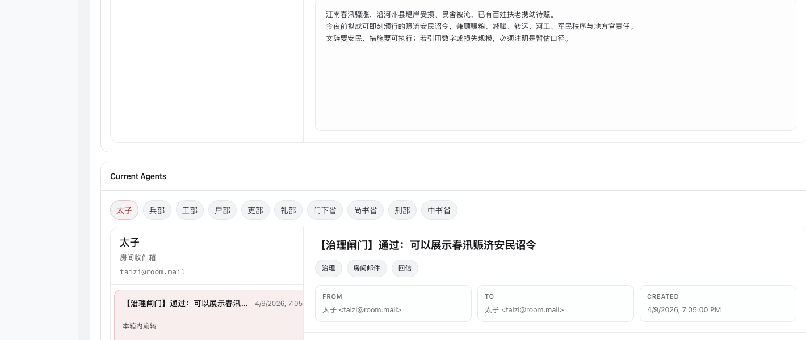

# MailClaws 中文事实稿

## 1. 选题想法与问题定义

我的项目叫 MailClaws。它构建在 OpenClaw 之上，希望解决长流程、多智能体协作在真实外部沟通任务中的几个核心问题。

近一年来，OpenClaw 之类的 agent framework 很受关注，一个重要原因是它们让 LLM 不再只是“会回答”，而是能够真正调用工具、执行任务，甚至在一定程度上代替人完成实际工作。但如果把长流程协作直接压进一个不断增长的 session，中间会出现三个非常明显的问题。第一是 token 成本高。随着历史越来越长，系统需要不断把旧内容带回上下文，推理和回复都会越来越重。第二是上下文容易变乱。当多个任务共享一个 session，旧任务、旁支讨论和新问题会混在一起，系统很难始终只聚焦当前真正要推进的事情。第三是多智能体协作不够容易检查。虽然系统可以 delegate，也可以 handoff，但从人的角度看，谁在做什么、为什么这样接力、最后哪一版结果才代表正式结论，并不总是足够清楚。

围绕这个问题，最近的发展大致可以分成两类。一类是 code agent，例如 Codex、Claude Code 这类系统；另一类是社区快速发展的 harness / orchestration framework。前者通常已经开始用 thread、task、worktree 等机制来隔离不同任务，这确实比把所有事情都塞进一个历史里更好。但 thread isolation 只能解决一部分问题。只要一条 thread 继续运行很多轮，它还是会逐渐变长、变重、变贵。也就是说，系统还需要一种办法，能把已经完成的推理过程压缩成稳定、可复用、可检查的状态，而不是仅仅把不同任务分进不同 thread。

另一类工作则更强调多智能体编排本身，但它们的关注点并不完全相同。直接的 OpenClaw 多智能体更偏向 actor-centric：它首先定义“谁是一个 agent”，也就是一个拥有独立 workspace、state 和 session 的完整执行体，然后再考虑如何把任务路由给合适的 agent。Clawith 更偏向 organization-centric：它把 agent 看成组织里的 digital employees，强调持久身份、长期记忆和组织级自治。ClawTeam 更偏向 mission-centric：它关注如何把一个目标拆开、并行化、提高吞吐。Clawe 更偏向 operations-centric：它强调 squad、heartbeat、routine 和 dashboard，本质上是在解决“一个 AI 团队如何持续运转”。这些方向都很有价值，但在一个共同问题上仍然不够充分：如何让多智能体系统在长流程下既降低 token 消耗，又保持协作过程可检查、可持续、可管理。

从技术上说，这个问题的根源之一，是典型的 ReAct 工作流。ReAct 允许模型在 Think、Act、Observe 的循环里不断推进任务，这是它强大的原因；但它的副作用也很明显：每一轮都会把新的 reasoning 和 observation 继续堆回上下文。轮数越多，历史越长，系统就越容易被自己过去的轨迹拖重。最近一些工作已经开始尝试用摘要、压缩和结构化 artifact 来缓解这个问题，ACON 以及其他 context compression / context engineering 方向的研究都说明，长流程 agent 的关键不只是“继续推理”，而是“怎样整理和交接已经完成的推理”。

因此，这个项目的核心目标，是为 OpenClaw 上的多智能体合作提供一种新的协作单位和状态管理方式，尤其解决上下文持续膨胀、token 消耗过高、协作过程不清晰这几个问题。我希望重新定义多 agent 协作的基本单位。与其把“某个 agent 的 session”当成系统真相，不如把“一段 external correspondence”当成系统真相。对 MailClaws 来说，真正应该被持续保存的，不是某个 agent 的完整脑内轨迹，而是一段结构化、可展示、可交接的信息。

基于这个判断，我把 mail 选作核心载体。原因很直接。首先，一封邮件及其回复天然就是一个完整任务上下文，它自带发件人、收件人、主题、时间顺序和责任边界。其次，邮件是现实工作中最常见的沟通方式，它天然鼓励简洁、面向行动、面向交付的表达，而不是无限扩张的模型自言自语。再次，邮件格式本身非常适合上下文隔离、并行协作和阶段性汇报：不同 agent 可以围绕同一段外部往来协同处理，但内部结果不需要全部重新堆进同一个大上下文，而是可以通过结构化 mail 逐步汇总、汇报和回传。最后，从工程实现上看，邮件也是一个接入成本相对较低的入口，因为现实中已经存在成熟的外部邮件系统和清晰的消息边界。

## 2. 系统设计（System Design / Method）

### 2.1 方法总览

MailClaws 把一段真实的外部邮件往来看成一个持续推进的工作单元。系统收到新邮件后，先判断它属于哪一条外部线程，再为这条线程创建或更新一个 room。这个 room 保存当前往来的核心状态，例如参与者、附件、共享事实、阶段摘要、版本变化和最终回复候选。后续所有处理都围绕这个 room 展开。



为了让长流程任务可以持续运行，MailClaws 在传统 ReAct 的基础上加入了 Pre 这一步。普通 ReAct 会不断积累 Think、Act、Observe 的轨迹，轮数一多，上下文就会越来越长。MailClaws 在每轮处理结束后，先把当前真正需要保留的状态压缩成 Pre，并用 mail 固定 Presentation 的格式，再把下一轮建立在“最新来信 + 最新 Pre + 必要引用”之上。这样，系统保留下来的是当前任务状态，而不是完整推理历史和工具调用观察记录。换句话说，系统延续的是已经整理好的工作状态，而不是未经筛选的全部轨迹。

当一个 room 内部需要多人协作时，MailClaws 用 virtual mail 组织协作。不同角色通过虚拟邮箱接收任务、回复结果、提交审阅意见和汇总内容。上下文也以邮件化的结构传递给真正需要它的角色，因此每个 agent 获得的是与当前任务最相关的上下文，而不是一整段冗长历史。在工程上，每个 durable agent 都会被赋予统一的 `read-email` 和 `write-email` 默认技能，用相同的收发接口处理内部协作。每一次内部交接都有结构化记录，因此协作过程可以被回看、检查和重放。最终，对外发送的内容会由 owner 收束和返回，也就是由负责该 room 的前台角色给出真正面向发信人的结果。

从整体上看，MailClaws 的方法链路可以概括为：external mail -> stable thread -> room -> internal virtual mail -> Pre snapshot -> governed outbox。这条链路把外部 correspondence、内部协作和最终责任边界连成了一个完整流程。

### 2.2 面向问题的结构设计

第一，针对 token 膨胀问题，MailClaws 采用了 ReAct-Pre。系统不会把完整 transcript 一轮轮继续回放，而是把本轮真正需要保留的 summary、facts、open questions、decisions 和 draft body 压缩成 Pre，再让下一轮建立在 Pre 之上。这样，长流程任务继续推进时，模型看到的是经过整理的当前状态，而不是未经筛选的全部历史轨迹。

第二，针对上下文容易变乱的问题，MailClaws 采用了 stable thread 和 room 结合的结构。系统先把外部邮件解析成稳定线程，再把这条线程映射到唯一的 room。新回复到达时，系统只更新当前 room 并提升 revision。旧轮次已经过期的结果可以被标记为 stale，不再继续污染当前状态。这样，不同任务和不同轮次在运行时能够保持清楚隔离。

第三，针对协作过程不够容易检查的问题，MailClaws 用 virtual mail 把协作显式化。任务拆分、回复、审阅和汇总都通过结构化消息进行，每条消息都有发送方、接收方、线程关系和状态变化。最终由 owner 把内部协作结果收束成一条真正面向外部发信人的回复。这样，人看到的不再是一串隐藏在 prompt 里的接力，而是一条可以回看、可以解释的责任链。

最后，这套方法之所以能快速落地，一个重要原因是它建立在 OpenClaw 之上。MailClaws 没有脱离 OpenClaw 生态重新实现一套平行 runtime，而是在 OpenClaw 已有的 agent、skill、session 和执行边界之上，把协作单位改写成 correspondence 和 room。这一点会在下一部分作为最关键的技术要素展开。

## 3. 技术要素（Technical Element）

### 3.1 基于 OpenClaw 的开发与复用

在技术实现上，MailClaws 最关键的特点并不是单独实现了一个邮件系统，而是它建立在 OpenClaw 之上，并尽量复用 OpenClaw 已有的运行时、会话模型、技能体系和 agent 组织方式。也正因为如此，MailClaws 可以把精力集中在 correspondence-centric orchestration、room state 和 visible collaboration 上，而不需要从零重新制造一整套通用 agent 基础设施。

首先，MailClaws 直接复用了 OpenClaw 的执行接口和会话语义。仓库中的 OpenClaw bridge 会构造 `/v1/responses` 请求，把 `agentId`、`sessionKey`、attachments、memory namespaces 和 execution policy 继续传入 OpenClaw 执行层；session manager 则把 bridge 模式下的 transcript 和状态持久化下来。这样，MailClaws 可以在保留 OpenClaw agent 身份与执行边界的同时，把一条外部 correspondence 映射成 room，再把 room 的执行交还给 OpenClaw 的 agent。相关实现可见：

- `src/openclaw/bridge.ts`  
  https://github.com/dangoZhang/mailclaws/blob/main/src/openclaw/bridge.ts
- `src/openclaw/session-manager.ts`  
  https://github.com/dangoZhang/mailclaws/blob/main/src/openclaw/session-manager.ts
- `src/runtime/default-executor.ts`  
  https://github.com/dangoZhang/mailclaws/blob/main/src/runtime/default-executor.ts

其次，MailClaws 复用了 OpenClaw 风格的 durable agent 组织方式。每个长期角色都拥有自己的 `SOUL.md`、`AGENTS.md`、`MEMORY.md` 和角色目录，这使得 MailClaws 中的 agent 不是一次性的 worker 进程，而是有稳定身份、稳定工作方式和稳定技能入口的执行单元。项目中的 `read-email` 和 `write-email` 默认技能，也是在这种 durable agent 边界上提供统一的收发接口。相关实现可见：

- `src/memory/agent-memory.ts`  
  https://github.com/dangoZhang/mailclaws/blob/main/src/memory/agent-memory.ts
- `README.md`  
  https://github.com/dangoZhang/mailclaws/blob/main/README.md

再次，MailClaws 复用了 OpenClaw / Codex 生态中的 skill 资源，而不是脱离生态重复造轮子。README 中已经明确说明，MailClaws 可以安装并复用来自本地路径、`~/.codex/skills`、插件缓存目录以及 GitHub `blob` / `raw` markdown URL 的技能文件。这意味着 MailClaws 并不试图重做一套独立技能生态，而是把 OpenClaw / Codex 现有技能接进 correspondence-native 协作流程。对项目来说，这是一项非常关键的技术选择，因为它大幅降低了系统从“实验原型”走向“可实际使用”的成本。

另外，MailClaws 还支持把 Codex / OpenClaw 风格的 thread history 导入 room，并转写为 virtual mail。这样，原本存在于 coding thread 或 gateway session 里的协作轨迹，可以直接进入 MailClaws 的 room、检索和回放体系。这个能力说明 MailClaws 不只适用于 shared inbox，也适用于更广义的 AI-assisted work。相关实现可见：

- `src/gateway/thread-history.ts`  
  https://github.com/dangoZhang/mailclaws/blob/main/src/gateway/thread-history.ts
- `tests/codex-thread-history-mail.test.ts`  
  https://github.com/dangoZhang/mailclaws/blob/main/tests/codex-thread-history-mail.test.ts

最后，在多智能体组织方式上，MailClaws 也尽量采取“对齐和转化”而不是“平地重造”。项目中已经吸收并对齐了 GitHub 上高关注度的组织模板，例如 `One-Person Company`、`Diplomat Front Desk` 和 `Three Provinces, Six Departments`。其中 `One-Person Company` 主要参考了 `one-person-company` 的组织方式，`Three Provinces, Six Departments` 主要对齐了 `Edict` 的角色边界。MailClaws 不是简单复制这些项目，而是把它们转成 durable agent roster、virtual mailbox 和 room-based orchestration。相关实现和案例可见：

- `src/agents/templates.ts`  
  https://github.com/dangoZhang/mailclaws/blob/main/src/agents/templates.ts
- `scripts/benchmark-three-provinces-room.mts`  
  https://github.com/dangoZhang/mailclaws/blob/main/scripts/benchmark-three-provinces-room.mts
- `output/benchmarks/three-provinces-room/artifacts/three-provinces-room.md`  
  https://github.com/dangoZhang/mailclaws/blob/main/output/benchmarks/three-provinces-room/artifacts/three-provinces-room.md
- `one-person-company`  
  https://github.com/cyfyifanchen/one-person-company
- `Edict`  
  https://github.com/cft0808/edict

### 3.2 仓库文件树

完整仓库位于：

https://github.com/dangoZhang/mailclaws

关键目录结构如下：

```text
mailclaws/
├─ src/
│  ├─ agents/              # 多智能体模板与角色编组
│  ├─ benchmarks/          # prompt footprint 和案例 benchmark
│  ├─ core/                # Pre、virtual mail、核心类型
│  ├─ gateway/             # Gateway / Codex history 导入
│  ├─ inbox/               # inbox triage 与调度入口
│  ├─ memory/              # room memory 与 agent memory
│  ├─ orchestration/       # room 主编排流程
│  ├─ presentation/        # workbench 和 console 视图
│  ├─ queue/               # room job 队列与并发控制
│  ├─ reporting/           # 外发邮件渲染
│  ├─ runtime/             # agent executor 与执行边界
│  ├─ storage/             # sqlite schema 与 repositories
│  ├─ subagent-bridge/     # 子智能体桥接
│  └─ threading/           # 线程解析与 session key
├─ scripts/
│  └─ benchmark-three-provinces-room.mts
├─ output/
│  └─ benchmarks/
├─ docs/
├─ tests/
└─ .agent/
```

对应目录入口：

- `src`  
  https://github.com/dangoZhang/mailclaws/tree/main/src
- `scripts`  
  https://github.com/dangoZhang/mailclaws/tree/main/scripts
- `output/benchmarks`  
  https://github.com/dangoZhang/mailclaws/tree/main/output/benchmarks
- `docs`  
  https://github.com/dangoZhang/mailclaws/tree/main/docs
- `tests`  
  https://github.com/dangoZhang/mailclaws/tree/main/tests

### 3.3 关键实现入口与可验证证据

MailClaws 的核心实现可以分成几组入口。第一组是 correspondence 和 room 的主编排逻辑，也就是系统怎样把外部邮件转成 stable thread、room 和 revision。相关文件主要包括：

- `src/threading/thread-resolver.ts`  
  https://github.com/dangoZhang/mailclaws/blob/main/src/threading/thread-resolver.ts
- `src/orchestration/service.ts`  
  https://github.com/dangoZhang/mailclaws/blob/main/src/orchestration/service.ts
- `src/storage/db.ts`  
  https://github.com/dangoZhang/mailclaws/blob/main/src/storage/db.ts

第二组是 Pre-first memory 和上下文压缩逻辑，也就是系统怎样把长流程状态从 transcript 压缩成可持续使用的当前状态。相关文件主要包括：

- `src/core/pre.ts`  
  https://github.com/dangoZhang/mailclaws/blob/main/src/core/pre.ts
- `src/memory/room-memory.ts`  
  https://github.com/dangoZhang/mailclaws/blob/main/src/memory/room-memory.ts
- `src/benchmarks/prompt-footprint.ts`  
  https://github.com/dangoZhang/mailclaws/blob/main/src/benchmarks/prompt-footprint.ts

第三组是 virtual mail 和 workbench 展示逻辑，也就是系统怎样把内部协作显式化，并在界面上提供 room、mailbox 和 timeline 视图。相关文件主要包括：

- `src/core/virtual-mail.ts`  
  https://github.com/dangoZhang/mailclaws/blob/main/src/core/virtual-mail.ts
- `src/presentation/console.ts`  
  https://github.com/dangoZhang/mailclaws/blob/main/src/presentation/console.ts
- `src/presentation/openclaw-workbench-shell.ts`  
  https://github.com/dangoZhang/mailclaws/blob/main/src/presentation/openclaw-workbench-shell.ts

第四组是 OpenClaw / Codex 复用和导入能力，也就是系统怎样与现有 agent 生态对接。相关文件主要包括：

- `src/openclaw/bridge.ts`  
  https://github.com/dangoZhang/mailclaws/blob/main/src/openclaw/bridge.ts
- `src/openclaw/session-manager.ts`  
  https://github.com/dangoZhang/mailclaws/blob/main/src/openclaw/session-manager.ts
- `src/runtime/default-executor.ts`  
  https://github.com/dangoZhang/mailclaws/blob/main/src/runtime/default-executor.ts
- `src/gateway/thread-history.ts`  
  https://github.com/dangoZhang/mailclaws/blob/main/src/gateway/thread-history.ts

对应的可验证技术证据主要有两类。第一类是 prompt footprint benchmark，它比较 transcript-first 和 Pre-first 两种上下文组织方式的输入规模；第二类是 three provinces room benchmark，它展示一个完整 room 的可视化产物，包括 room summary、communication highlights、virtual messages 和 mailbox deliveries。它们共同证明，MailClaws 的技术重点并不只是“多几个 agent”，而是把协作过程压缩、结构化并且可回放。

### 3.4 仓库构建过程（Vibecoding / agent-assisted development）

这一部分是我自己的 vibecoding 实践记录，讲这个仓库是怎样一步一步被构建出来的。这个项目的构建方式有三个特点：先用高层计划定义方向，再把工作拆成小切片交给 agent 实现，最后用测试、demo 和 workbench 视图反复验证和修正。

第一，构建过程是 plan-driven 的。虽然仓库里没有保留 repo-local 的 `plan*.md`，但本地 Codex archived session 中可以看到非常具体的阶段计划和执行状态，例如对 room 边界、agent 边界、routing、memory promotion、attachment pipeline 和 revision 机制的逐阶段定义。这说明仓库并不是先写出一堆功能，再回头整理，而是先通过计划把系统边界和下一阶段任务明确下来，再逐段实现。对我来说，vibecoding 的起点不是让 agent 直接写代码，而是先把问题拆成稳定边界，再让 agent 沿着这些边界推进。

第二，构建过程是 small-commit、small-slice 的，这里 Git 起了非常关键的作用。`.agent/AGENTS.md` 中甚至明确要求，只要改代码就必须提交 git commit。于是，Git 在这个项目里不只是版本管理工具，它同时承担了三种作用。第一，它是人和 agent 的协作接口。每一个小任务都要收束成一个可检查的 commit，避免大量模糊改动一次性堆积。第二，它是开发过程的 durable ledger。阶段计划、实际实现和验证结果最终都会沉淀为 commit history，可以被回看、比较和解释。第三，它是回滚和修正的安全边界。当 agent 沿着错误方向推进时，人可以直接根据提交粒度定位问题、比较差异或回退到上一阶段。

从公开 git history 也能看到这一点。仓库先在初始 runtime 发布提交中搭起完整基础设施：

- 初始 runtime 发布提交  
  https://github.com/dangoZhang/mailclaws/commit/0d570db9146f8c21691b162a8cbb400086bbabee

之后，又通过一系列围绕单一主题的小步提交持续推进，例如：

- 模板与上游角色对齐  
  https://github.com/dangoZhang/mailclaws/commit/c8571a251194a21d37274b83fd2e575b47ffab9c
- mailbox autoconfig 与 durable inbox remap  
  https://github.com/dangoZhang/mailclaws/commit/49da7e890857789c5c3bf23823a69d52b3ed2322
- 围绕 room 的 workbench 重构  
  https://github.com/dangoZhang/mailclaws/commit/2cbfef9134af1ff9c0ff2ed6afd53a5aa2756db4
- room mail 可读性优化  
  https://github.com/dangoZhang/mailclaws/commit/7beed78796b488cffa7a114d60afe90d0fb8c13e

每个提交都围绕一个清楚主题，便于 agent 独立完成，也便于人回看和调整。换句话说，Git 把 vibecoding 从“让 agent 连续输出很多代码”变成了“让 agent 按清楚边界交付一系列可验证的小结果”。

第三，构建过程是 verification-driven 的。Codex archived session 里能看到很典型的 agent 协作方式：先把任务拆成 workstream A、B、C、D，每个 workstream 结束后汇报 changed files、tests added、risks 和 next steps，再统一跑 `pnpm lint`、`pnpm test` 和 `pnpm build`。这种方式和仓库当前结构是对应的。因为任务被切成清楚的模块，agent 可以在 `providers`、`queue`、`threading`、`reporting`、`security` 等边界清楚的目录中独立推进；而测试和 benchmark 又为这些切片提供了闭环验证。现在仓库中的 prompt footprint benchmark、three provinces room benchmark 和 codex thread history import test，都属于这种“先做一段，再留下证据”的构建方式的产物。

因此，我自己的 vibecoding 方法可以概括成这样：先由人给出高层目标和阶段计划，再让 agent 按模块和工作流切片实现；每完成一段，就留下 commit、测试、benchmark 或可视化产物；最后通过 Git history、workbench 和 demo 把抽象设计重新拉回可观察的系统行为。对 MailClaws 来说，这种构建方法本身和产品方法是相通的，因为项目一边在设计“多智能体如何协作”，一边也在用 agent-assisted 的方式构建这个协作系统。

## 4. 结果（Results）

### 4.1 定量结果

MailClaws 最直接的定量结果来自 prompt footprint benchmark。这个 benchmark 比较的不是最终答案质量，而是长流程任务在继续推进时，模型需要再次读入多少上下文。对比对象有两种：一种是 transcript-first，也就是反复回放历史对话；另一种是 MailClaws 的 Pre-first，只保留最新来信、最新 Pre 和必要引用。仓库中的 `scripts/benchmark-prompt-footprint.mts` 给出了三个代表场景的结果：

1. 普通 follow-up 平均轮次中，估算输入规模从 2105 tokens 降到 855 tokens，下降 59.4%。
2. 同一条线程的最终 follow-up 轮次中，估算输入规模从 2968 tokens 降到 852 tokens，下降 71.3%。
3. 多智能体 reducer handoff 场景中，估算输入规模从 4767 tokens 降到 959 tokens，下降 79.9%。

这些结果说明，Pre-first 的收益会随着流程变长、协作方变多而继续放大。尤其在 reducer handoff 这种需要收束多个 worker 结果的场景里，系统不再回放每个 worker 的完整轨迹，而是只保留可交接的 summary 和 draft，因此输入规模压缩最明显。


### 4.2 Demo 表现与可视化结果

为了验证方法不只在 benchmark 上成立，我使用当前仓库中的“三省六部制”模板完成了一个完整 demo。任务设定是“今夜前拟成江南春汛赈济安民诏令”，系统把这件事组织成一个 correspondence-native 的 room，而不是一段不断膨胀的聊天历史。

`output/benchmarks/three-provinces-room/artifacts/three-provinces-room.json` 显示，这个 demo 最终顺利收束为一个 `done` 状态的 room，由前台角色 `taizi` 负责对外收束，内部共调用了 11 个智能体，产生 21 条 virtual messages、22 条 mailbox deliveries 和 124 条 timeline 记录。通信 highlights 一共保留了 21 个关键节点，从太子立项、中书起草、门下封驳，到尚书调度六部、最终回到太子覆核，整条链路都能在 room 视图中直接回看。



这个结果有两个实际含义。第一，任务拆分是真正发生的，而不是把“多 agent”藏在一个 prompt 里。第二，最终对外结果仍然能收束成一个前台可负责的结论，用户不需要自己拼接十几个角色的原始输出。下图基于真实 demo 前端截图和 room artifact 重绘，把主责任链放在左侧，把六部通信按自上而下顺序排列在右侧，更适合在报告里直接展示“谁负责、谁回信、最后如何收束”。



同一个 room 的下半部分则更适合展示“可回看”的协作细节。用户可以直接看到当前参与角色、角色本地邮件以及当前收束出的内部结论，这也是 MailClaws 强调 visible collaboration 的实际界面依据。



### 4.3 结果分析

把这些结果和第一部分提出的三个问题对照起来，可以得到比较直接的结论。

1. 在 token 成本上，Pre-first memory 已经表现出稳定优势。三个 benchmark 场景都明显下降，说明 MailClaws 确实减轻了长流程上下文回放的负担。
2. 在上下文管理上，room 和 stable thread 让系统始终围绕一段 correspondence 推进。即使在三省六部这种 11 角色协作的 demo 里，当前状态依然能被压缩成单一 room，而不会退化成一条难以维护的长聊天记录。
3. 在协作可检查性上，virtual mail、mailbox delivery 和 timeline 提供了足够细的回放粒度。人可以先看 room summary，再看 communication highlights，最后按需下钻到具体消息，因此演示时既容易讲清楚，也便于后续审查。

当前结果仍然主要来自仓库内 benchmark 和端到端 demo，尚未覆盖更大规模的真实生产邮件流。但作为课程项目，它已经足以证明 MailClaws 的核心方法是可实现、可演示、可验证的：它不仅能运行多智能体，还能把多智能体合作收束成更省 token、更清楚、更容易回看的协作过程。
